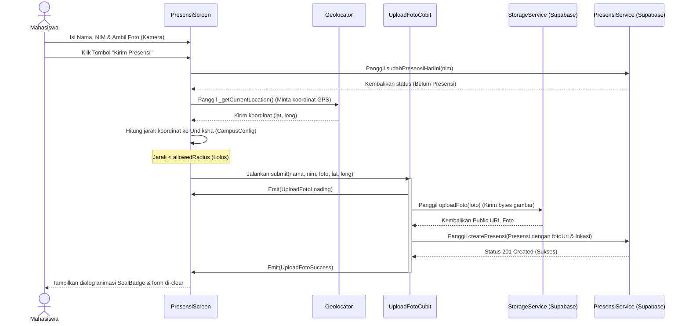

# Panduan Persiapan Ujian Lisan UAS Pemrograman Mobile
**Aplikasi: Presensi UAS (Presensi SIFORS)**

Dokumen ini disusun khusus sebagai bahan belajar Anda untuk menghadapi ujian lisan esok hari. Semua penjelasan mengacu langsung pada kode riil di dalam project Anda.

---

## 📚 DAFTAR ISI
1. [Pemetaan 4 Ketentuan Wajib Dosen](#bagian-1--pemetaan-ke-ketentuan-dosen)
2. [Alur Aplikasi End-to-End (Langkah-demi-Langkah)](#bagian-2--alur-aplikasi-end-to-end)
3. [Alasan Penggunaan Supabase vs API Dosen](#bagian-3--kenapa-supabase-bukan-api-dosen)
4. [Bukti HTTP Request (Supabase SDK vs HTTP Manual)](#bagian-4--klarifikasi-soal-ini-http-beneran-atau-bukan)
5. [Skema Database & Row Level Security (RLS)](#bagian-5--struktur-database-dan-keamanan)
6. [Audit Titik Lemah & Argumen Defensif untuk Sidang](#bagian-6--titik-lemah-yang-harus-diantisipasi)
7. [Glosarium Istilah Teknis Aplikasi](#bagian-7--istilah-teknis-yang-mungkin-ditanya)

---

## BAGIAN 1 — Pemetaan ke Ketentuan Dosen

Berikut adalah lokasi persis pemenuhan 4 kriteria wajib UAS di dalam kode Anda agar Anda bisa menunjukkannya langsung kepada dosen penguji:

### 1. Widget Rendering (Penyusunan & Tampilan UI)
* **File Utama**: [main_navigation_screen.dart](file:///c:/Users/Dwijothamy/develop/flutter_project/presensi_uas/lib/screens/main_navigation_screen.dart) dan [presensi_screen.dart](file:///c:/Users/Dwijothamy/develop/flutter_project/presensi_uas/lib/screens/presensi_screen.dart).
* **Fungsi/Baris Kode**:
  * **Navigasi Tab Utama**: `MainNavigationScreen` merender navigasi tab bawah menggunakan `BottomNavigationBar` ([main_navigation_screen.dart:L29-50](file:///c:/Users/Dwijothamy/develop/flutter_project/presensi_uas/lib/screens/main_navigation_screen.dart#L29-50)). Bodi aplikasi dirender dinamis berdasarkan indeks terpilih ([main_navigation_screen.dart:L28](file:///c:/Users/Dwijothamy/develop/flutter_project/presensi_uas/lib/screens/main_navigation_screen.dart#L28)).
  * **Form Input & Validasi Visual**: `_PresensiFormState.build` merender form input data berupa `TextField` untuk Nama dan NIM, serta menampilkan *conditional rendering* (penayangan kondisional) berdasarkan status foto ([presensi_screen.dart:L231-327](file:///c:/Users/Dwijothamy/develop/flutter_project/presensi_uas/lib/screens/presensi_screen.dart#L231-327)). Jika foto kosong, merender kotak instruksi; jika terisi, menampilkan gambar hasil jepretan kamera.
  * **Custom Widget**: `SealBadge` ([seal_badge.dart](file:///c:/Users/Dwijothamy/develop/flutter_project/presensi_uas/lib/widgets/seal_badge.dart)) merender stempel dekoratif dengan logo dinamis yang dipakai di halaman Home dan dialog sukses.

### 2. Navigation & Routing (Perpindahan Halaman)
* **File Utama**: [main.dart](file:///c:/Users/Dwijothamy/develop/flutter_project/presensi_uas/lib/main.dart) dan [riwayat_screen.dart](file:///c:/Users/Dwijothamy/develop/flutter_project/presensi_uas/lib/screens/riwayat_screen.dart).
* **Fungsi/Baris Kode**:
  * **Declarative / Named Routing (Rute Terpusat)**: Diinisialisasi di `MaterialApp` menggunakan properti `initialRoute` dan `routes` ([main.dart:L17-20](file:///c:/Users/Dwijothamy/develop/flutter_project/presensi_uas/lib/main.dart#L17-20)) untuk mengarahkan ke halaman dasar (`'/'` mengarah ke `MainNavigationScreen`).
  * **Imperative Routing (Perpindahan Dinamis)**: Di `RiwayatScreen`, ketika item daftar presensi ditekan, aplikasi berpindah ke detail presensi menggunakan `Navigator.push` dengan `MaterialPageRoute` ([riwayat_screen.dart:L57-60](file:///c:/Users/Dwijothamy/develop/flutter_project/presensi_uas/lib/screens/riwayat_screen.dart#L57-60)).

### 3. Network & Data Fetching (Komunikasi Data API)
* **File Utama**: [presensi_service.dart](file:///c:/Users/Dwijothamy/develop/flutter_project/presensi_uas/lib/services/presensi_service.dart).
* **Fungsi/Baris Kode**:
  * **GET Request (Ambil Data)**: Fungsi `getPresensiList()` menggunakan method `http.get` untuk memanggil endpoint database REST API Supabase, lalu mendaur-ulang respon JSON menjadi objek list Flutter ([presensi_service.dart:L13-25](file:///c:/Users/Dwijothamy/develop/flutter_project/presensi_uas/lib/services/presensi_service.dart#L13-25)).
  * **POST Request (Kirim Data)**: Fungsi `createPresensi(Presensi presensi)` menggunakan method `http.post` untuk mengirim data berformat JSON ke database Supabase ([presensi_service.dart:L27-41](file:///c:/Users/Dwijothamy/develop/flutter_project/presensi_uas/lib/services/presensi_service.dart#L27-41)).
  * **GET Request dengan Query Parameter (Cek Presensi Harian)**: Fungsi `sudahPresensiHariIni(String nim)` menyaring data presensi berdasarkan NIM dan waktu pembuatan hari ini ([presensi_service.dart:L43-57](file:///c:/Users/Dwijothamy/develop/flutter_project/presensi_uas/lib/services/presensi_service.dart#L43-57)).

### 4. Camera & Upload (Pengambilan Gambar & Unggah File)
* **File Utama**: [presensi_screen.dart](file:///c:/Users/Dwijothamy/develop/flutter_project/presensi_uas/lib/screens/presensi_screen.dart) dan [storage_service.dart](file:///c:/Users/Dwijothamy/develop/flutter_project/presensi_uas/lib/services/storage_service.dart).
* **Fungsi/Baris Kode**:
  * **Meminta Izin Kamera**: Menggunakan `Permission.camera.request()` dari package `permission_handler` sebelum kamera dinyalakan ([presensi_screen.dart:L38-46](file:///c:/Users/Dwijothamy/develop/flutter_project/presensi_uas/lib/screens/presensi_screen.dart#L38-46)).
  * **Mengakses Kamera HP**: Menggunakan `ImagePicker().pickImage(source: ImageSource.camera)` ([presensi_screen.dart:L47-51](file:///c:/Users/Dwijothamy/develop/flutter_project/presensi_uas/lib/screens/presensi_screen.dart#L47-51)).
  * **Kompresi Gambar**: Parameter `imageQuality: 70` disematkan langsung di pemanggilan `pickImage` untuk mengompres kualitas foto menjadi 70% sebelum disimpan guna menghemat ruang penyimpanan server.
  * **Upload File**: Fungsi `StorageService.uploadFoto(File file)` membaca file gambar sebagai *raw bytes* (`file.readAsBytes()`) lalu mengirimkannya lewat HTTP POST request ke endpoint Supabase Storage bucket `foto-presensi` ([storage_service.dart:L9-30](file:///c:/Users/Dwijothamy/develop/flutter_project/presensi_uas/lib/services/storage_service.dart#L9-30)).

---

## BAGIAN 2 — Alur Aplikasi End-to-End

Berikut adalah alur lengkap di balik layar sejak pengguna mengisi data presensi hingga data tercatat aman di server:

### Langkah demi Langkah di Tingkat Kode:
1. **Input Data & Foto**: Mahasiswa mengetik Nama/NIM dan menekan "Ambil Foto". Fungsi `_ambilFoto()` membuka kamera fisik melalui library `image_picker`. Hasil jepretan disimpan di memori lokal HP sebagai objek `File? _fotoFile`.
2. **Menekan Kirim**: Fungsi `_submit()` dipanggil.
3. **Cek Duplikasi Presensi**: Fungsi `PresensiService.sudahPresensiHariIni(nim)` dipanggil secara asinkron. Sistem mengirim HTTP GET request dengan filter tanggal hari ini. Jika database mengembalikan baris data, presensi ditolak ("Kamu sudah presensi hari ini").
4. **Cek Jarak GPS (Geofencing)**:
   - Aplikasi memanggil `_getCurrentLocation()` via package `geolocator` untuk mendapatkan koordinat lintang/bujur pengguna.
   - Jarak dihitung dengan `Geolocator.distanceBetween` membandingkan koordinat GPS user dengan titik kampus di `CampusConfig`. Jika jarak melebihi batas, presensi dihentikan.
5. **Menjalankan Cubit (`UploadFotoCubit.submit()`)**:
   - Status Cubit berubah menjadi `UploadFotoLoading()` sehingga UI menampilkan animasi loading (`CircularProgressIndicator`).
   - Melakukan panggilan ke `StorageService.uploadFoto()` untuk mengirim bytes gambar. Supabase Storage menyimpan file tersebut dan mengembalikan tautan publiknya (URL).
   - Cubit membuat objek data `Presensi` lengkap yang di dalamnya tersimpan link foto dari storage dan koordinat GPS.
   - Objek dikirim via `PresensiService.createPresensi()`.
6. **Selesai**: Jika database membalas dengan status HTTP `201` (Created), Cubit memancarkan state `UploadFotoSuccess()`. Di layar, `BlocConsumer` menangkap perubahan state ini, lalu menampilkan dialog animasi sukses stempel emas (`SealBadge`) dan mengosongkan kolom isian form.

---

## BAGIAN 3 — Kenapa Supabase, Bukan API Dosen?

Jika dosen bertanya: *"Kenapa Anda memilih menggunakan Supabase, bukannya API yang sudah disediakan oleh dosen/jurusan?"* 

### Jawaban yang Dapat Anda Sampaikan:
> "Untuk proyek UAS ini, kami memilih menggunakan **Supabase** sebagai *Backend-as-a-Service* (BaaS) dengan beberapa alasan arsitektural dan teknis:
> 1. **Penyimpanan File Terintegrasi (Storage Bucket)**: Fitur presensi ini membutuhkan penyimpanan foto bukti fisik dari kamera mahasiswa. API bawaan kuliah umumnya hanya menyediakan penyimpanan data teks (database), tidak mencakup penyimpanan file binary/gambar. Supabase menyediakan PostgreSQL database sekaligus Storage Bucket yang terintegrasi secara bawaan.
> 2. **Kecepatan Pengembangan & Fleksibilitas**: Supabase memangkas waktu pengembangan backend secara signifikan. Kami tidak perlu mendeploy backend server terpisah (misalnya menggunakan Express atau Laravel) hanya untuk menerima unggahan gambar dan menulis data ke database.
> 3. **Kemampuan Geofencing Spasial**: Supabase berbasis database PostgreSQL. Di masa mendatang jika ingin dikembangkan ke tahap komersial, database ini mendukung ekstensi **PostGIS** untuk perhitungan geospasial/koordinat yang sangat presisi di sisi server."

### Trade-off (Konsekuensi Pilihan):
* **Ketergantungan Layanan Cloud (Vendor Lock-in)**: Aplikasi sangat bergantung pada server cloud Supabase. Jika server Supabase mengalami kendala (down), aplikasi tidak dapat berfungsi.
* **Keamanan Kunci API**: Karena tidak ada server perantara (backend middleware), kunci autentikasi API (`anon key`) disimpan langsung di dalam aplikasi Flutter client-side. Ini memindahkan risiko keamanan ke sisi client.

---

## BAGIAN 4 — Klarifikasi: "Ini HTTP Beneran atau Bukan?"

Ada kesalahpahaman umum bahwa memakai platform seperti Supabase berarti tidak melakukan *network fetching* (karena tidak menulis kueri SQL manual). Anda harus membantah ini dengan pembuktian teknis yang jelas.

### Jawaban Teknis:
1. **Tidak Menggunakan SDK**: Pada project ini, kita **tidak** mengimpor package resmi `supabase_flutter`. Kita menulis request HTTP manual menggunakan package `http` bawaan Dart (seperti `http.get` dan `http.post`) ke endpoint REST API Supabase.
2. **Cara Kerja REST API Supabase**: Supabase memiliki program di servernya bernama **PostgREST** yang otomatis membaca skema database PostgreSQL dan menyediakannya sebagai endpoint API HTTP RESTful.
3. **Penerjemahan Protokol**: Ketika method `http.post` memanggil URL `${SupabaseConfig.baseUrl}/presensi` dengan format JSON, request dikirim melalui protokol jaringan **HTTP/1.1** atau **HTTP/2**. Di server Supabase, PostgREST akan membaca isi JSON tersebut dan menerjemahkannya menjadi kueri SQL (`INSERT INTO presensi ...`).

### Cara Membuktikan ke Dosen:
Jika dosen meminta bukti bahwa ada lalu lintas jaringan (HTTP request) yang terkirim:
* **Bukti 1 (Supabase Dashboard Logs)**:
  1. Buka dashboard Supabase Anda di web browser.
  2. Masuk ke tab **Monitor** > **API Logs** atau **Edge Functions Logs**.
  3. Tunjukkan log request HTTP POST yang masuk ke endpoint `/rest/v1/presensi` dengan status code `201 Created` dan data unggah foto di `/storage/v1/object/foto-presensi` dengan status code `200 OK`.
* **Bukti 2 (Flutter/Chrome DevTools Network)**:
  1. Jalankan aplikasi di Google Chrome, lalu tekan **F12** untuk membuka Developer Tools.
  2. Buka tab **Network**.
  3. Lakukan presensi di aplikasi. Di tab Network akan terekam baris panggilan HTTP POST baru ke domain `lcvijimhcyujnfrzxkbk.supabase.co` lengkap dengan Request Headers (`apikey`, `authorization`, `content-type`) dan Response Payload-nya.

---

## BAGIAN 5 — Struktur Database dan Keamanan

### 1. Skema Tabel Database `presensi`
Tabel `presensi` di database Supabase Anda memiliki struktur sebagai berikut:
* `id` (`int8`, Primary Key, Auto-Increment): Identitas unik setiap baris presensi.
* `nama` (`text`, Not Null): Menyimpan nama mahasiswa.
* `nim` (`text`, Not Null): Menyimpan Nomor Induk Mahasiswa.
* `foto_url` (`text`): Menyimpan alamat tautan (URL) foto bukti kehadiran yang tersimpan di storage bucket.
* `latitude` (`float8`): Titik koordinat lintang tempat presensi dilakukan.
* `longitude` (`float8`): Titik koordinat bujur tempat presensi dilakukan.
* `created_at` (`timestamptz`, Default: `now()`): Waktu penulisan data ke database (otomatis diisi oleh server Supabase berdasarkan zona waktu UTC).

### 2. Skema Storage Bucket `foto-presensi`
Bucket ini diatur dengan opsi **Public Access Enabled** (Akses Publik Aktif) agar URL foto yang disimpan di tabel database (`foto_url`) dapat dibaca dan ditampilkan langsung oleh widget image Flutter tanpa perlu melakukan proses tanda tangan token (signing URL) yang rumit.

### 3. Kebijakan Row Level Security (RLS)
* **Status**: RLS diaktifkan pada tabel `presensi` dan bucket `foto-presensi`.
* **Aturan (Policy)**: Diatur ke tipe **Permissive / Allow All** (`USING (true)`).
* **Konsekuensi Keamanan**: Aturan `true` ini berarti tidak ada pembatasan hak akses di sisi database. Siapa saja yang mengetahui API Key `anon` aplikasi Anda dapat melakukan kueri pembacaan data (`SELECT`) maupun penulisan data (`INSERT`) tanpa perlu login ke sistem.
* **Justifikasi untuk UAS**: Kebijakan ini dipilih semata-mata demi efisiensi pengerjaan prototype tugas kuliah. Membatasi RLS secara ketat menuntut sistem memiliki modul autentikasi akun (Sign In/Sign Up mahasiswa) terlebih dahulu. Dalam lingkup UAS, fokus utama dinilai dari fungsionalitas visual rendering, integrasi kamera lokal, dan kalkulasi lokasi GPS di sisi client.

---

## BAGIAN 6 — Titik Lemah yang Harus Saya Antisipasi

Dosen penguji yang teliti biasanya akan mencari titik celah keamanan atau logika program. Berikut adalah kelemahan-kelemahan sistem Anda beserta jawaban defensif yang aman:

### Kelemahan 1: Validasi Lokasi Dilakukan di Sisi Client (Client-Side Geofencing)
* **Penjelasan Kelemahan**: Pengecekan jarak koordinat dilakukan di file [presensi_screen.dart](file:///c:/Users/Dwijothamy/develop/flutter_project/presensi_uas/lib/screens/presensi_screen.dart#L174-191). Pengguna nakal dapat memodifikasi kode aplikasi, memanipulasi koordinat GPS lewat aplikasi *Fake GPS* di HP, atau membypass aplikasi dengan menembak REST API Supabase secara langsung menggunakan Postman.
* **Jawaban Defensif Anda**: 
  > *"Benar sekali Pak, saat ini kalkulasi jarak geofencing dilakukan di sisi client (aplikasi Flutter) demi menyederhanakan kode prototype. Untuk tingkat produksi (production-ready), idealnya koordinat mentah GPS dikirim ke server backend tertutup, lalu server menghitung jaraknya menggunakan fungsi spasial database (seperti PostGIS di PostgreSQL). Dengan begitu, mahasiswa tidak bisa memanipulasi lokasi presensi lewat modifikasi data client."*

### Kelemahan 2: Cek Duplikasi Presensi Memakai Waktu HP Mahasiswa
* **Penjelasan Kelemahan**: Di fungsi `sudahPresensiHariIni`, variabel tanggal hari ini dihitung menggunakan `DateTime.now()` di HP ([presensi_screen.dart:L44-45](file:///c:/Users/Dwijothamy/develop/flutter_project/presensi_uas/lib/screens/presensi_screen.dart#L44-45)). Mahasiswa bisa mengubah setelan jam di HP mereka ke hari kemarin agar bisa presensi susulan.
* **Jawaban Defensif Anda**:
  > *"Betul Pak. Saat ini filter waktu masih mengandalkan jam internal perangkat handphone pengguna. Untuk implementasi sesungguhnya, pengecekan waktu kehadiran wajib disinkronkan dengan waktu server database (Server Time) menggunakan query database `now()` PostgreSQL agar manipulasi waktu di HP mahasiswa tidak berpengaruh."*

### Kelemahan 3: Radius Presensi Sangat Besar (50.000 Kilometer)
* **Penjelasan Kelemahan**: Variabel `CampusConfig.allowedRadiusMeters` diatur ke nilai `50000000` meter ([campus_config.dart:L7](file:///c:/Users/Dwijothamy/develop/flutter_project/presensi_uas/lib/config/campus_config.dart#L7)), sehingga pengecekan lokasi seolah-olah tidak berguna karena mahasiswa bisa melakukan presensi dari belahan dunia mana pun.
* **Jawaban Defensif Anda**:
  > *"Angka radius sengaja saya set besar untuk keperluan pengujian dan demonstrasi aplikasi di depan Bapak hari ini agar kita bisa menguji fungsionalitas presensi secara sukses dari tempat kita berada saat ini tanpa terblokir karena jauh dari titik koordinat asli Undiksha. Pada rilis resmi, nilai radius ini cukup diubah ke nilai realistis seperti `50` meter."*

### Kelemahan 4: Penyimpanan Kunci API Secara Terbuka (Hardcoded)
* **Penjelasan Kelemahan**: Kunci `apiKey` dan `projectUrl` dideklarasikan secara tertulis langsung di file kode Dart ([supabase_config.dart:L2-6](file:///c:/Users/Dwijothamy/develop/flutter_project/presensi_uas/lib/config/supabase_config.dart#L2-6)).
* **Jawaban Defensif Anda**:
  > *"Penyimpanan API key secara hardcoded ini merupakan trade-off kepraktisan untuk mempercepat pengerjaan tugas kuliah UAS. Pada sistem komersial, API Key akan disimpan dengan aman menggunakan file `.env` lewat package `flutter_dotenv` atau disandikan di memori aman perangkat menggunakan package seperti `flutter_secure_storage` agar tidak mudah diekstrak saat file APK didekompilasi."*

---

## BAGIAN 7 — Istilah Teknis yang Mungkin Ditanya

Kuasai definisi operasional dari istilah-istilah berikut agar Anda terlihat sangat memahami teknologi yang Anda pakai:

* **Row Level Security (RLS)**: Fitur keamanan bawaan PostgreSQL yang membatasi hak akses membaca/menulis baris data berdasarkan aturan kebijakan (*policies*) tertentu. Di project ini, kita mengaktifkannya di Supabase namun memberikan akses penuh (`true`) untuk menyederhanakan integrasi client database tanpa sistem login.
* **Anon Key (Anonymous Key)**: Kunci akses publik yang disediakan Supabase untuk dipasang di aplikasi client. Kunci ini aman ditaruh di dalam kode aplikasi karena hak aksesnya dikendalikan secara dinamis di server menggunakan RLS database.
* **PostgREST**: Teknologi di balik Supabase yang otomatis mengubah database PostgreSQL menjadi API berbasis REST (HTTP) siap pakai secara instan tanpa perlu coding backend manual.
* **Widget Tree**: Struktur hierarki pohon objek di Flutter yang menggambarkan bagaimana antarmuka pengguna disusun dari elemen induk ke elemen anak (contoh: `Scaffold` -> `Column` -> `TextField`).
* **State Management (Cubit)**: Sistem terstruktur untuk mengelola siklus perubahan data/status aplikasi dan memerintahkan UI untuk merender ulang secara otomatis saat terjadi perubahan status data tersebut.
* **Geofencing**: Teknologi pembatasan area geografis virtual di dunia nyata menggunakan koordinat GPS (lintang & bujur) serta perhitungan radius lingkaran jarak aman.
* **Data Transfer Object (DTO) / Model Class**: Kelas representasi struktur objek data di Flutter (seperti kelas `Presensi` di [presensi.dart](file:///c:/Users/Dwijothamy/develop/flutter_project/presensi_uas/lib/dto/presensi.dart)) yang berfungsi untuk mengonversi data dari objek aplikasi menjadi struktur JSON (`toJson`) untuk dikirim ke API, dan sebaliknya (`fromJson`).
* **kReleaseMode / kDebugMode**: Konstanta global di Flutter untuk mendeteksi apakah aplikasi sedang dijalankan dalam mode pengembangan untuk perbaikan kode (debug) atau mode kompilasi akhir siap edar (release).
