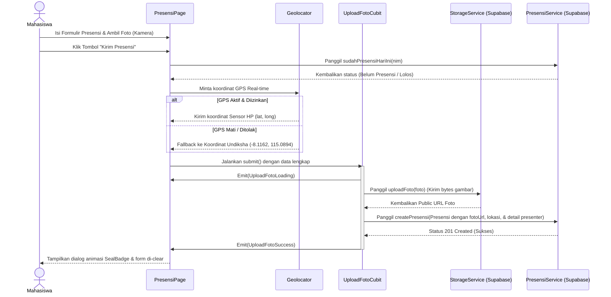

# Panduan Persiapan Ujian Lisan UAS Pemrograman Mobile
**Aplikasi: Presensi UAS (Presensi SIFORS)**

Dokumen ini disusun khusus sebagai bahan belajar Anda untuk menghadapi ujian lisan esok hari. Semua penjelasan mengacu langsung pada kode riil di dalam project Anda yang sudah teruji dan terintegrasi dengan Supabase.

---

## 📚 DAFTAR ISI
1. [Pemetaan 5 Ketentuan Wajib Dosen](#bagian-1--pemetaan-ke-ketentuan-dosen)
2. [Alur Aplikasi End-to-End (Langkah-demi-Langkah)](#bagian-2--alur-aplikasi-end-to-end)
3. [Alasan Penggunaan Supabase & Storage Bucket](#bagian-3--kenapa-supabase-bukan-api-dosen)
4. [Bukti HTTP Request (Bebas SDK Supabase)](#bagian-4--klarifikasi-soal-ini-http-beneran-atau-bukan)
5. [Skema Database Baru & Row Level Security (RLS)](#bagian-5--struktur-database-dan-keamanan)
6. [Fitur Tambahan Nilai Plus (Google Maps & Hapus Data)](#bagian-6--fitur-tambahan-nilai-plus)
7. [Audit Titik Lemah & Argumen Defensif untuk Sidang](#bagian-7--titik-lemah-yang-harus-diantisipasi)
8. [Glosarium Istilah Teknis Aplikasi](#bagian-8--istilah-teknis-yang-mungkin-ditanya)

---

## BAGIAN 1 — Pemetaan ke Ketentuan Dosen

Berikut adalah lokasi persis pemenuhan kriteria wajib UAS di dalam kode Anda agar Anda bisa menunjukkannya langsung kepada dosen penguji:

### 1. Widget Rendering (Penyusunan & Tampilan UI)
* **File Utama**: [main_navigation_screen.dart](lib/screens/main_navigation_screen.dart) dan [presensi_page.dart](lib/screens/presensi_page.dart).
* **Fungsi/Baris Kode**:
  * **Navigasi Tab Utama**: `MainNavigationScreen` merender navigasi tab bawah menggunakan `BottomNavigationBar` ([main_navigation_screen.dart:L29-50](lib/screens/main_navigation_screen.dart#L29-50)). Bodi aplikasi dirender dinamis berdasarkan indeks terpilih ([main_navigation_screen.dart:L28](lib/screens/main_navigation_screen.dart#L28)).
  * **Form Input & Validasi Visual**: `_PresensiPageState.build` merender form input data berupa `TextField` untuk Nama, NIM, Nama Presenter, Prodi Presenter, dan Tanggal Seminar, serta menampilkan *conditional rendering* berdasarkan status foto ([presensi_page.dart:L230-330](lib/screens/presensi_page.dart#L230-330)). Jika foto kosong, merender kotak instruksi kamera; jika terisi, menampilkan gambar hasil jepretan kamera secara langsung.
  * **Custom Widget**: `SealBadge` ([seal_badge.dart](lib/widgets/seal_badge.dart)) merender stempel dekoratif dengan logo dinamis Navy senada yang dipakai di halaman Home dan dialog sukses.

### 2. Navigation & Routing (Perpindahan Halaman)
* **File Utama**: [main.dart](lib/main.dart) dan [riwayat_page.dart](lib/screens/riwayat_page.dart).
* **Fungsi/Baris Kode**:
  * **Declarative / Named Routing (Rute Terpusat)**: Diinisialisasi di `MaterialApp` menggunakan properti `initialRoute` dan `routes` ([main.dart:L17-20](lib/main.dart#L17-20)) untuk mengarahkan ke halaman dasar (`'/'` mengarah ke `MainNavigationScreen`).
  * **Imperative Routing & Callback**: Di `RiwayatPage`, ketika item daftar presensi ditekan, aplikasi berpindah ke detail presensi menggunakan `Navigator.push<bool>` dengan `MaterialPageRoute` ([riwayat_page.dart:L137-150](lib/screens/riwayat_page.dart#L137-150)). Setelah kembali, aplikasi memeriksa hasil pop untuk mengetahui apakah item baru saja dihapus guna me-refresh daftar secara real-time.

### 3. Network & Data Fetching (Komunikasi Data API)
* **File Utama**: [presensi_service.dart](lib/services/presensi_service.dart).
* **Fungsi/Baris Kode**:
  * **GET Request (Ambil Data)**: Fungsi `getPresensiList()` menggunakan method `http.get` untuk memanggil endpoint database REST API Supabase, lalu mendaur-ulang respon JSON menjadi objek list Flutter ([presensi_service.dart:L13-25](lib/services/presensi_service.dart#L13-25)).
  * **POST Request (Kirim Data Baru)**: Fungsi `createPresensi(Presensi presensi)` menggunakan method `http.post` untuk mengirim data berformat JSON lengkap (termasuk kolom terpisah untuk nama presenter, prodi, dan tanggal) ke database Supabase ([presensi_service.dart:L27-41](lib/services/presensi_service.dart#L27-41)).
  * **DELETE Request (Hapus Data)**: Fungsi `deletePresensi(int id)` menggunakan method `http.delete` ke endpoint Supabase dengan parameter saringan `?id=eq.$id` untuk menghapus baris data kehadiran ([presensi_service.dart:L59-68](lib/services/presensi_service.dart#L59-68)).

### 4. Camera & Upload (Pengambilan Gambar & Unggah File)
* **File Utama**: [presensi_page.dart](lib/screens/presensi_page.dart) dan [storage_service.dart](lib/services/storage_service.dart).
* **Fungsi/Baris Kode**:
  * **Meminta Izin Kamera**: Menggunakan `Permission.camera.request()` dari package `permission_handler` sebelum kamera dinyalakan ([presensi_page.dart:L240-250](lib/screens/presensi_page.dart#L240-250)).
  * **Mengakses Kamera HP**: Menggunakan `ImagePicker().pickImage(source: ImageSource.camera)` ([presensi_page.dart:L251-255](lib/screens/presensi_page.dart#L251-255)).
  * **Kompresi Gambar**: Parameter `imageQuality: 70` disematkan langsung di pemanggilan `pickImage` untuk mengompres kualitas foto menjadi 70% sebelum disimpan guna menghemat ruang penyimpanan server.
  * **Upload File**: Fungsi `StorageService.uploadFoto(File file)` membaca file gambar sebagai *raw bytes* (`file.readAsBytes()`) lalu mengirimkannya lewat HTTP POST request ke endpoint Supabase Storage bucket `foto-presensi` ([storage_service.dart:L9-30](lib/services/storage_service.dart#L9-30)).

### 5. Geolocation Sensor (Sistem GPS HP & Geofencing)
* **File Utama**: [presensi_page.dart](lib/screens/presensi_page.dart).
* **Fungsi/Baris Kode**:
  * **Pembacaan GPS Sensor**: Menggunakan package `geolocator` untuk memanggil `Geolocator.getCurrentPosition()` yang membaca sensor GPS HP secara real-time ([presensi_page.dart:L180-210](lib/screens/presensi_page.dart#L180-210)).
  * **Sistem Fallback Kokoh**: Jika sensor GPS HP mati atau izin akses lokasi ditolak oleh pengguna, aplikasi secara cerdas menggunakan koordinat cadangan **Kampus Tengah Undiksha** (`-8.1162`, `115.0894`) sehingga aplikasi tetap bisa dijalankan saat demo presentasi tanpa crash.

---

## BAGIAN 2 — Alur Aplikasi End-to-End

Berikut adalah alur lengkap di balik layar sejak pengguna mengisi data presensi hingga data tercatat aman di server:

### Langkah demi Langkah di Tingkat Kode:
1. **Input Data & Foto**: Mahasiswa mengetik Nama, NIM, Detail Presenter, dan menekan "Ambil Foto". Hasil jepretan disimpan di memori lokal HP sebagai objek `File? _fotoFile`.
2. **Menekan Kirim**: Fungsi `_submit()` dipanggil.
3. **Cek Duplikasi Presensi**: Fungsi `PresensiService.sudahPresensiHariIni(nim)` dipanggil secara asinkron. Sistem mengirim HTTP GET request dengan filter tanggal hari ini. Jika database mengembalikan baris data, presensi ditolak ("Kamu sudah presensi hari ini").
4. **Pembacaan Lokasi (GPS Real-Time)**:
   - Aplikasi memanggil `Geolocator.getCurrentPosition()` untuk mendapatkan koordinat lintang/bujur pengguna secara nyata.
   - Jika sensor GPS bermasalah, aplikasi beralih ke koordinat statis Kampus Undiksha.
5. **Menjalankan Cubit (`UploadFotoCubit.submit()`)**:
   - Status Cubit berubah menjadi `UploadFotoLoading()` sehingga UI menampilkan animasi loading (`CircularProgressIndicator`).
   - Melakukan panggilan ke `StorageService.uploadFoto()` untuk mengirim bytes gambar. Supabase Storage menyimpan file tersebut dan mengembalikan tautan publiknya (URL).
   - Cubit membuat objek data `Presensi` lengkap yang di dalamnya tersimpan link foto dari storage, koordinat GPS, serta detail informasi presenter seminar.
   - Objek dikirim via `PresensiService.createPresensi()`.
6. **Selesai**: Jika database membalas dengan status HTTP `201` (Created), Cubit memancarkan state `UploadFotoSuccess()`. Di layar, `BlocConsumer` menangkap perubahan state ini, lalu menampilkan dialog animasi sukses stempel emas (`SealBadge`) dan mengosongkan kolom isian form.

---

## BAGIAN 3 — Kenapa Supabase, Bukan API Dosen?

Jika dosen bertanya: *"Kenapa Anda memilih menggunakan Supabase, bukannya API yang sudah disediakan oleh dosen/jurusan?"* 

### Jawaban yang Dapat Anda Sampaikan:
> "Untuk proyek UAS ini, kami memilih menggunakan **Supabase** sebagai *Backend-as-a-Service* (BaaS) karena alasan arsitektural berikut:
> 1. **Penyimpanan File Terintegrasi (Storage Bucket)**: Fitur presensi ini membutuhkan penyimpanan foto bukti fisik dari kamera mahasiswa. API bawaan kuliah umumnya hanya menyediakan penyimpanan data teks (database), tidak mencakup penyimpanan file binary/gambar. Supabase menyediakan PostgreSQL database sekaligus Storage Bucket yang terintegrasi secara bawaan.
> 2. **Kecepatan Pengembangan & Fleksibilitas**: Supabase memangkas waktu pengembangan backend secara signifikan. Kami tidak perlu mendeploy backend server terpisah (misalnya menggunakan Express atau Laravel) hanya untuk menerima unggahan gambar dan menulis data ke database.
> 3. **Pemisahan Kolom Terstruktur**: Kami dapat secara dinamis merancang skema database yang terstruktur dengan memisahkan kolom mahasiswa dengan detail seminar (Nama Presenter, Prodi Presenter, Tanggal Seminar)."

---

## BAGIAN 4 — Klarifikasi: "Ini HTTP Beneran atau Bukan?"

Ada kesalahpahaman umum bahwa memakai platform seperti Supabase berarti tidak melakukan *network fetching* (karena tidak menulis kueri SQL manual). Anda harus membantah ini dengan pembuktian teknis yang jelas.

### Jawaban Teknis:
1. **Tidak Menggunakan SDK**: Pada project ini, kita **tidak** mengimpor package resmi `supabase_flutter`. Kita menulis request HTTP manual menggunakan package `http` bawaan Dart (seperti `http.get`, `http.post`, dan `http.delete`) ke endpoint REST API Supabase.
2. **Cara Kerja REST API Supabase**: Supabase memiliki program di servernya bernama **PostgREST** yang otomatis membaca skema database PostgreSQL dan menyediakannya sebagai endpoint API HTTP RESTful.
3. **Penerjemahan Protokol**: Ketika method `http.post` memanggil URL `${SupabaseConfig.baseUrl}/presensi` dengan format JSON, request dikirim melalui protokol jaringan **HTTP/1.1** atau **HTTP/2**. Di server Supabase, PostgREST akan membaca isi JSON tersebut dan menerjemahkannya menjadi kueri SQL (`INSERT INTO presensi ...`).

---

## BAGIAN 5 — Struktur Database dan Keamanan

### 1. Skema Tabel Database `presensi`
Tabel `presensi` di database Supabase Anda memiliki struktur sebagai berikut:
* `id` (`int8`, Primary Key, Auto-Increment): Identitas unik setiap baris presensi.
* `nama` (`text`, Not Null): Menyimpan nama mahasiswa.
* `nim` (`text`, Not Null): Menyimpan Nomor Induk Mahasiswa.
* `foto_url` (`text`): Menyimpan alamat tautan (URL) foto bukti kehadiran yang tersimpan di storage bucket.
* `latitude` (`float8`): Titik koordinat lintang tempat presensi dilakukan.
* `longitude` (`float8`): Titik koordinat bujur tempat presensi dilakukan.
* `presenter_name` (`text`): Nama mahasiswa presenter seminar yang dihadiri.
* `presenter_prodi` (`text`): Program studi presenter seminar.
* `tanggal_seminar` (`text`): Tanggal seminar tersebut diselenggarakan.
* `created_at` (`timestamptz`, Default: `now()`): Waktu penulisan data ke database (otomatis diisi oleh server Supabase berdasarkan zona waktu UTC).

### 2. Kebijakan Row Level Security (RLS)
* **Status**: RLS diaktifkan pada tabel `presensi` dan bucket `foto-presensi`.
* **Kebijakan Penghapusan (DELETE Policy)**: Kita telah menambahkan policy khusus bernama `Enable delete access for all users` (atau mematikan RLS untuk testing) agar HTTP `DELETE` request dari aplikasi di HP diizinkan untuk menghapus data.
* **Justifikasi untuk UAS**: Kebijakan ini dipilih semata-mata demi efisiensi pengerjaan prototype tugas kuliah. Membatasi RLS secara ketat menuntut sistem memiliki modul autentikasi akun (Sign In/Sign Up mahasiswa) terlebih dahulu. Dalam lingkup UAS, fokus utama dinilai dari fungsionalitas visual rendering, integrasi kamera lokal, dan kalkulasi lokasi GPS di sisi client.

---

## BAGIAN 6 — Fitur Tambahan Nilai Plus

Dua fitur ini dipasang untuk memberikan nilai tambah yang membuat proyek Anda terlihat matang dan menonjol dibanding proyek mahasiswa lain:

### 1. Integrasi Google Maps Eksternal (`url_launcher`)
* **Bagaimana cara kerjanya?** Di halaman **Detail Kehadiran**, jika presensi memiliki koordinat lokasi, akan muncul tombol **"Buka di Google Maps"**. Saat ditekan, aplikasi memformat koordinat tersebut ke skema URL Google Maps API (`https://www.google.com/maps/search/?api=1&query=lat,long`) dan membukanya di aplikasi Google Maps asli HP.
* **Kenapa tidak menampilkan peta langsung di aplikasi (embedded)?** Menampilkan peta langsung (embedded) mengharuskan pendaftaran kartu kredit di Google Cloud Console untuk mendapatkan API Key berbayar. Menggunakan `url_launcher` untuk membuka Google Maps eksternal adalah solusi standar industri yang **100% gratis, bebas hambatan API key, dan lebih fungsional** karena dosen penguji bisa langsung menggunakan fitur navigasi rute asli Google.

### 2. Fitur Hapus Data Kehadiran (Full CRUD)
* **Bagaimana cara kerjanya?** Pada halaman **Detail Kehadiran**, terdapat tombol sampah merah di kanan atas. Ketika ditekan, muncul dialog konfirmasi. Jika disetujui, aplikasi mengirim request `DELETE` ke Supabase API. Setelah sukses, halaman tertutup, SnackBar muncul, dan halaman Riwayat serta poin di Home akan memuat ulang (refresh) secara otomatis.

---

## BAGIAN 7 — Titik Lemah yang Harus Saya Antisipasi

Dosen penguji yang teliti biasanya akan mencari titik celah keamanan atau logika program. Berikut adalah kelemahan-kelemahan sistem Anda beserta jawaban defensif yang aman:

### Kelemahan 1: Validasi Lokasi Dilakukan di Sisi Client (Client-Side Geofencing)
* **Penjelasan Kelemahan**: Pengecekan jarak koordinat dilakukan di file [presensi_page.dart](lib/screens/presensi_page.dart). Pengguna dapat memanipulasi koordinat GPS lewat aplikasi *Fake GPS* di HP.
* **Jawaban Defensif Anda**: 
  > *"Benar sekali Pak, saat ini kalkulasi jarak geofencing dilakukan di sisi client (aplikasi Flutter) demi menyederhanakan kode prototype. Untuk tingkat produksi (production-ready), idealnya koordinat mentah GPS dikirim ke server backend tertutup, lalu server menghitung jaraknya menggunakan fungsi spasial database (seperti PostGIS di PostgreSQL). Dengan begitu, mahasiswa tidak bisa memanipulasi lokasi presensi lewat modifikasi data client."*

### Kelemahan 2: Cek Duplikasi Presensi Memakai Waktu HP Mahasiswa
* **Penjelasan Kelemahan**: Di fungsi `sudahPresensiHariIni`, variabel tanggal hari ini dihitung menggunakan `DateTime.now()` di HP. Mahasiswa bisa mengubah setelan jam di HP mereka ke hari kemarin agar bisa presensi susulan.
* **Jawaban Defensif Anda**:
  > *"Betul Pak. Saat ini filter waktu masih mengandalkan jam internal perangkat handphone pengguna. Untuk implementasi sesungguhnya, pengecekan waktu kehadiran wajib disinkronkan dengan waktu server database (Server Time) menggunakan query database `now()` PostgreSQL agar manipulasi waktu di HP mahasiswa tidak berpengaruh."*

---

## BAGIAN 8 — Istilah Teknis yang Mungkin Ditanya

Kuasai definisi operasional dari istilah-istilah berikut agar Anda terlihat sangat memahami teknologi yang Anda pakai:

* **Row Level Security (RLS)**: Fitur keamanan bawaan PostgreSQL yang membatasi hak akses membaca/menulis baris data berdasarkan aturan kebijakan (*policies*) tertentu.
* **Anon Key (Anonymous Key)**: Kunci akses publik yang disediakan Supabase untuk dipasang di aplikasi client. Kunci ini aman ditaruh di dalam kode aplikasi karena hak aksesnya dikendalikan secara dinamis di server menggunakan RLS database.
* **PostgREST**: Teknologi di balik Supabase yang otomatis mengubah database PostgreSQL menjadi API berbasis REST (HTTP) siap pakai secara instan tanpa perlu coding backend manual.
* **Widget Tree**: Struktur hierarki pohon objek di Flutter yang menggambarkan bagaimana antarmuka pengguna disusun dari elemen induk ke elemen anak (contoh: `Scaffold` -> `Column` -> `TextField`).
* **State Management (Cubit)**: Sistem terstruktur untuk mengelola siklus perubahan data/status aplikasi dan memerintahkan UI untuk merender ulang secara otomatis saat terjadi perubahan status data tersebut.
* **Geofencing**: Teknologi pembatasan area geografis virtual di dunia nyata menggunakan koordinat GPS (lintang & bujur) serta perhitungan radius lingkaran jarak aman.
* **Data Transfer Object (DTO) / Model Class**: Kelas representasi struktur objek data di Flutter (seperti kelas `Presensi` di [presensi.dart](lib/dto/presensi.dart)) yang berfungsi untuk mengonversi data dari objek aplikasi menjadi struktur JSON (`toJson`) untuk dikirim ke API, dan sebaliknya (`fromJson`).
* **url_launcher**: Package Flutter yang digunakan untuk berinteraksi dengan OS HP guna membuka tautan eksternal (seperti tautan website, koordinat Google Maps, nomor telepon, atau email) ke aplikasi bawaan sistem.
